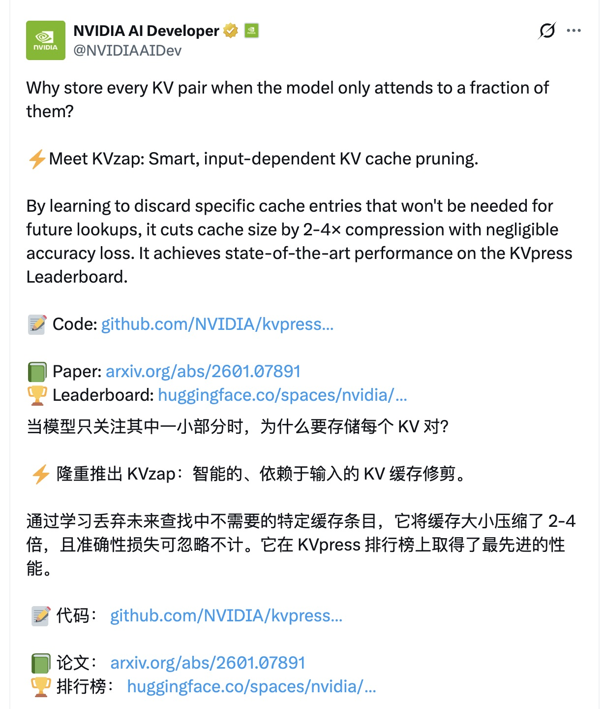
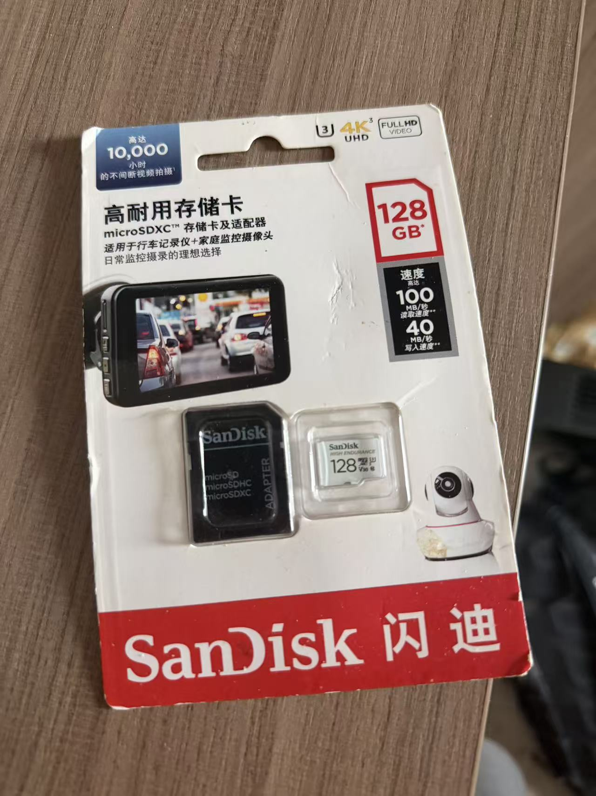
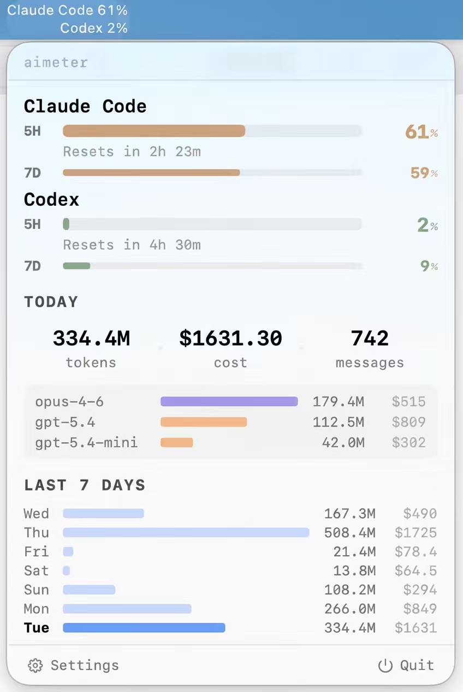
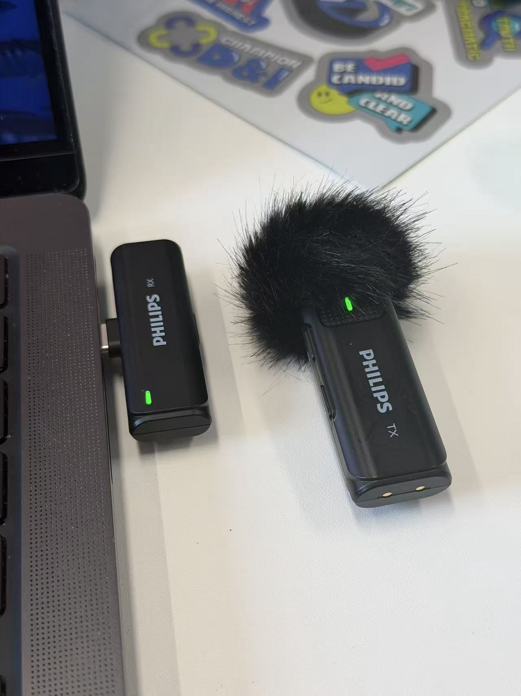
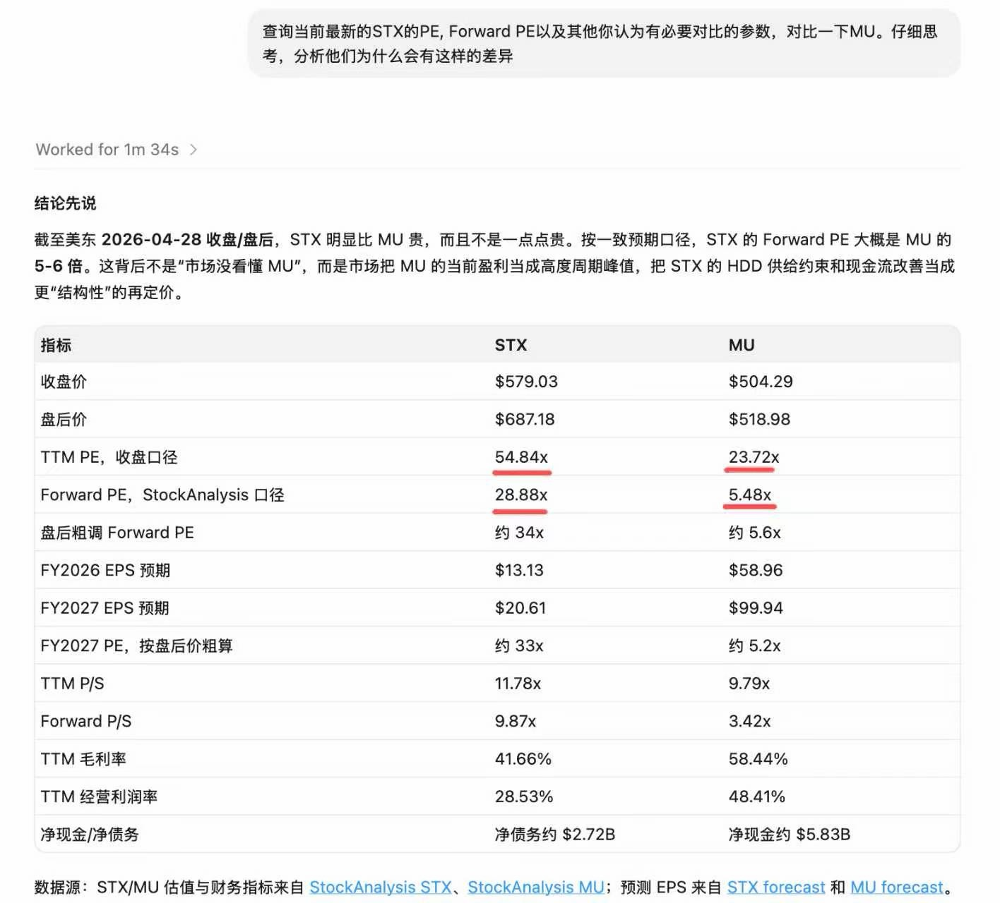
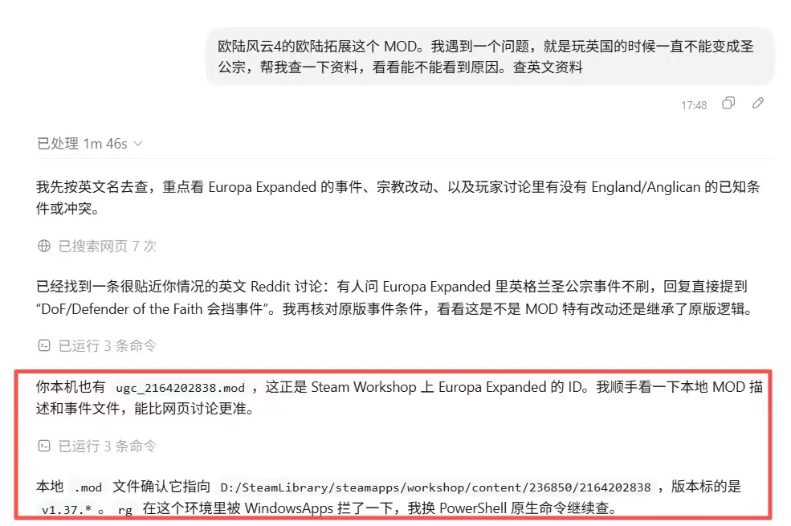
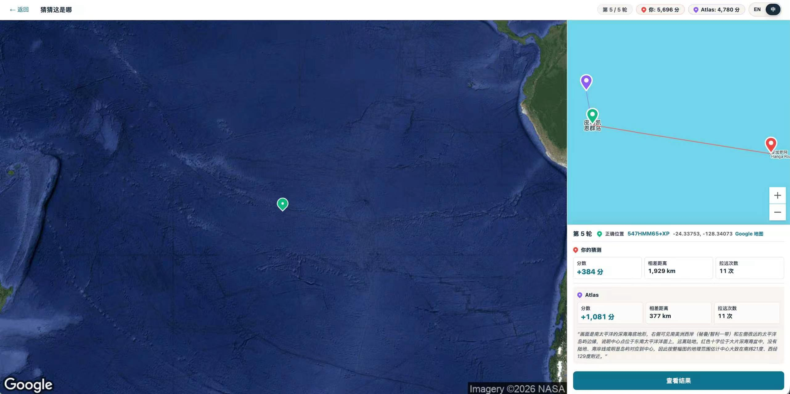
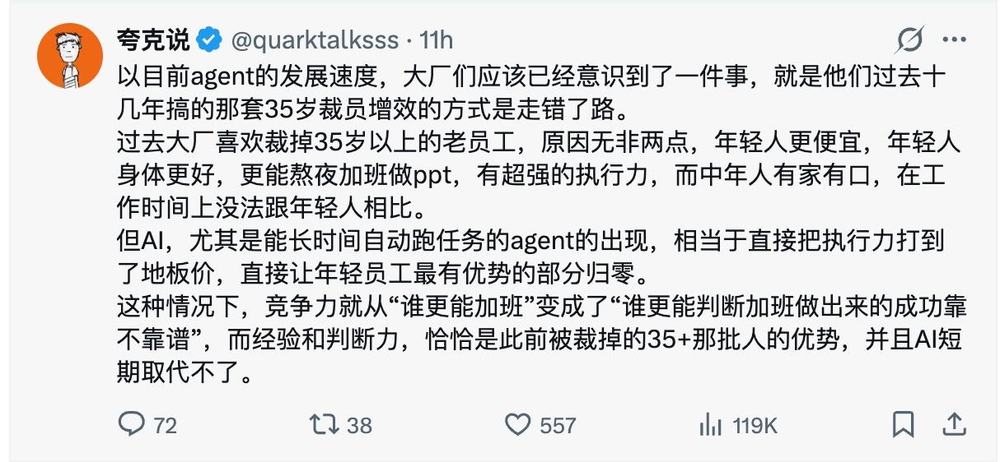
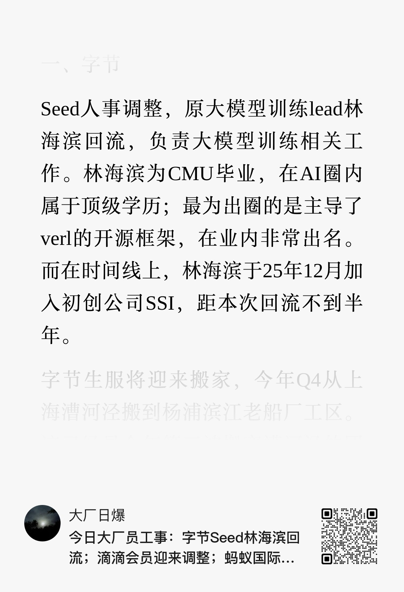
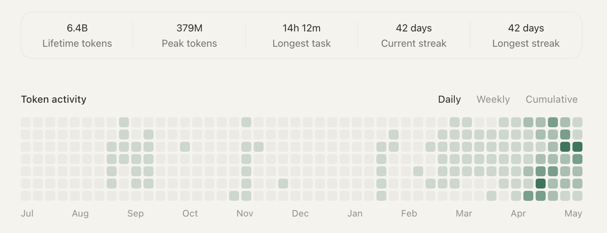

## 2026-1-3

### 1

我正在把我所有的文字资料都通过claude&nbsp;code搬运到obsidian，主要是这些年累积的有道云笔记，为知笔记，ios&nbsp;notes，和一些零零碎碎的；数据就跑在我自己的硬盘上，后续自己想办法做数据备份和云同步

后续我应该会尽可能尝试将自己产生的所有“数据”都尽可能保存下来，比如笔记、想法、收集的资料、甚至是白天说的话等等，我觉得会在AI进入到持续学习时代后有大用，我也推荐大家也尽可能多保留自己的数据，也许比到时候从0开始积累数据会有一些优势

其实我个人猜测openai正在做的硬件产品，可能就是这个方向

### 2

嗯，7x24的视频记录和AI分析一定会实现的，我感觉现在的大模型从能力上来讲都没问题，抽帧+图片识别就行，就是成本有点高，估计token成本还得下降一个数量级吧

## 2026-1-5

### 1

我个人推测，以后会有一个趋势，就是越能够被AI很好的处理的工厂会越成为主流，越是主流的框架和组件会越更加的主流，那些越是和solid的原则，跟高内聚低耦合的原则相悖的设计都会逐渐的被淘汰。因为在一个充分竞争的自由市场环境里，这些东西人的效率是一定赶不上AI的

### 2

是，我感觉“寻常质量”的代码的供应量很快就要达到无限了，以后工程师（如果还有的话）的工作内容应该是得多做减法

### 3

这个话题我亲身实验了一下。我从二三魔方能够导出我的原始的基因测序数据，大概是一个&nbsp;20MB&nbsp;的文件。我让&nbsp;Claude&nbsp;Code&nbsp;去分析，分析了大概&nbsp;10&nbsp;多轮吧，让它不断地去提高对我的数据的分析的覆盖度。我会让它去查询权威的医学英文资料。去作为他分析的依据，并且给我生成一个报告，这个报告的分析的质量深度我感觉是二三魔方自带的那个分析的，2&nbsp;到&nbsp;3&nbsp;倍以上，不管是详实程度还是我收获的程度

如果是以往的话这是一个难以想象的工作量

数据处理的成本会越来越低的，关键在于数据本身的价值

## 2026-1-6

作为老SRE，我确实觉得claude&nbsp;code已经是最好的shell

肯定有人会问AI执行rm&nbsp;-rf&nbsp;/&nbsp;怎么办，我会说这是AI的问题，不是我的问题，这显然是一个很好解决的问题，但能理解确实会有很多问题，让AI来处理会面临相当大的风险。看过&nbsp;反脆弱&nbsp;的同学，应该能理解我的意思：这是一个风险收益曲线开口向下的领域，也就是收益可能有限，但亏损可能极大

也许这种领域是注定没法很好地适配AI的，那只能说很可惜，这是这个领域的问题，而不是AI的问题

## 2026-1-11

今天补了一下前两天马斯克的访谈，其中提到的这点，挺启发的，也许&nbsp;记忆复用&nbsp;也是一个scaling&nbsp;law，而且这必然发生。试想一下，如果把所有用户使用claude&nbsp;code的skills都动态学习收集起来（暂且不考虑负面效果），那会是一种怎样的光景

这必然发生，利好存储，家人们

## 2026-1-16

今天看到一个nvda的论文，粗略理解就是能减少一部分对dram的需求量，但会牺牲精度，但不是所有AI场景都需要精度

感觉2026年在存储这块会有不少算法和架构上的突破

我认为有了新的算法和架构，若是对存储的需求越少，其实越利好存储，到时候别看反了

## 2026-1-21

供应ai需求的利润高。上游厂商倾向于多去做ai相关的东西，比如美光去做服务器dram，不做手机nand。台积电去给英伟达造gpu，减少给iphone&nbsp;m系列的产能。消费者本来就价格敏感，需求也稳定，ai需求又爆炸增长又溢价高，so

去年九月1400买的64g内存条，现在6000了快。我预计后续ssd也是这个涨价趋势，台积电这么发展下去cpu也得涨价这都还没算dram需求挤压nand产能的事呢

## 2026-1-27

clawdbot配好了，minimax-m2.1&nbsp;+&nbsp;perplexity

1.&nbsp;体感上，配置起来比较费劲，是用claude&nbsp;code帮忙配置的

2.&nbsp;从能力上来讲对我来说不如claude&nbsp;code，基础模型、搜索能力、执行代码的能力差点意思

3.&nbsp;它的亮点是开箱即用的IM接入；“长期记忆能力”，但我还没测出来；看起来内置和定时任务和SKILLS也许也能帮到我，还不确定

4.&nbsp;不过终于能用IM随时和自己的AI交流了，我认为这个入口将来一定会进一步强化，人们（即便是绝大多数工程师）还是更喜欢用和人类交流的方式，和机器进行交流。

总体来说感觉并无法利好cpu或者macmini，它并不需要吃多少CPU，它的效果上限的关键还是在于底层模型的能力，例如模型的tool&nbsp;calling能力、长期记忆、token成本。至于定时任务、接入IM、内置SKILLS之类的，我感觉仍然是个产品化问题，不是AI能力问题。大概就先这样，如果有进一步的发现我再同步

如果以后clawdbot或者此类软件，能和其他agent进行联动，那我感觉才会有所不同。比如说，我的clawdbot，和你的clawdbot（以及其他真实世界中能够进行交互的对象，比如电脑环境、手机环境、真实世界之类的）去约吃饭的时间、智能合约上开个盘、交换最近的炒股记录之类的。从大模型能力上来讲这不是难事

那总体来看，这还是得依赖多模态能力、tool&nbsp;calling、长期记忆，以及token成本的事情。感觉别急，这些事情我个人认为2026年都会发生质变（看好程度就是我提到这些东西的顺序，从高到低）

## 2026-1-30

### 1

仔细一琢磨的话，我的人生中长达&nbsp;2/3&nbsp;的时间都在支持英伟达、西捷、西部数据、闪迪、美光这些公司啊

查了一下我小时候用的那台电脑，显卡是英伟达的&nbsp;TNT2，硬盘是西捷的一个&nbsp;80GB&nbsp;的硬盘，我记得很清楚，还是新加坡生产的。内存我实在是不记得了，但是问了一下豆包，它推测最大的可能性是海力士的前身现代出产的

这么说的话，给25年老用户返点利也是应该的🥲

### 2

[对话MiniMax&nbsp;Agent团队：“没有Agent企业敢说自己有壁垒”](https://mp.weixin.qq.com/s?__biz=MzA5NDc1NzQ4MA==&mid=2654636449&idx=1&sn=232e1d5de352ec02bfc8f23895525a44&chksm=8ae6d3ca050f7e5efb0e96b9bc3891a3dacaa942b1dda06f5382e5a99bc5ce8e0da7120ada82&mpshare=1&scene=1&srcid=012846KhHlwWdTmDtJK6Dlwc&sharer_shareinfo=52eaeca738118f9956053e4f74812c47&sharer_shareinfo_first=52eaeca738118f9956053e4f74812c47#rd)

非常好的内容，和我对ai&nbsp;agent未来的发展方向的理解完全一致（当然，比我全面多了）

1.&nbsp;agent主要运行在个人设备上

2.&nbsp;组织流程的转变对agent落地更重要，相比技术问题

3.&nbsp;更多的context，更好的memory，更好的效果

4.&nbsp;持续学习

5.&nbsp;有一点他没明说，但很显然token成本是个问题。哪家能先把token成本打下来，可能会有很大优势，希望deepseek春节前能捣鼓点东西出来。先提个醒，到时候NVDA要拿住了

### 3

分享一些近期具体的判断，就不发到公众号了，感觉不好意思。当然了如果有不一样的想法，超级欢迎和我交流下，急需不一样的观点的输入

1.&nbsp;存储行情今年会非常好的，再有人说dram和nand的周期的事，别太在意。在ai需求下，现在的存储和以前的存储不是一种东西了。

关键词：持续学习，agent，世界模型

现在随机抓一个华尔街的人，问他为啥ai推理对存储需求这么大，他真不一定能说的明白

2.&nbsp;看好程度美光＞闪迪＞＞希捷＝西数。今天做了点功课，不太看好hdd对ai需求的满足。qlc&nbsp;nand的每tb成本，比hdd阵列看起来差不了太多了。而且考虑到机房电力成为瓶颈的话，qlc&nbsp;nand还有额外的优势，因为省点

3.&nbsp;相比国产算力，更看好国产存储。存储领域的软件门槛低太多了，相比cuda。

这里我有在买的是中韩半导体etf和永赢先锋半导体。中韩是因为能买到三星和海力士，真正的优质资产。永赢先锋是我看下来存储纯度最高的。

但我个人不推荐现在买了，如果没有我这个看好存储的程度，对回撤的体感会和我不太一样，我是真的无感，类似去年nvda&nbsp;140到87我一路买，虽然经常一次买1股，但都还挺高兴的，但买astera浮亏我就不得劲，后来割肉了

## 2026-2-6

这两天google&nbsp;capex翻番，opus&nbsp;4.6发布，gpt&nbsp;5.3发布（说是全面使用GB200训练+推理），用起来效果都不错，感觉平时的话，nvda和mu已经爆拉了

想说华尔街在AI面前可能显得有点弱智，没法指望他们能很快理解5.3和5.2有啥差别，但这两天的一个感想就是，不要做想要获利了结的弱智的有钱人的对手盘😑

## 2026-2-26

近期打算写两个文章，记录下我最近的一些思考，但核心观点就是两点，和大家分享下~

1.&nbsp;每个人都应该尽可能远离AI所无法触及的领域，除非你在里面待的很稳定，护城河足够深；AI能很好地解决搬运比特的问题，以后能解决搬运原子的问题（机器人），但预计不能很好解决权力和分配的问题，局部可能会改善（比如每个人都能用豆包获取“足够准确”的信息），但全局可能会恶化

2.&nbsp;今天AI对编程领域的“智力输出”环节的替代，终会扩散到一切依赖“智力输出”领域；“智力输入”环节应该还是需要的，比如判断怎样的产品是用户所需要的；但输出环节绝大多数人类会拖AI的后退，比如现在古法手写代码大概率是在耽误事

## 2026-3-2

我是觉得以后有一个趋势是大模型的线上的持续学习，也就是持续的训练环节，这个事好像都还没怎么聊呢。这要是聊下来，我估计内存的需求缺口还得大不少

## 2026-3-3

我刚才还在想一个问题，就是这个&nbsp;iPhone&nbsp;搞这个&nbsp;Apple&nbsp;Intelligence，搞来搞去的，我觉得还不如它直接能原生支持，让&nbsp;龙虾能装在我的手机上，这比什么&nbsp;Intelligence&nbsp;都更靠谱

## 2026-3-6

一个随感。今天在想一个问题，类似openclaw这样的应用，如果以后演化为AI助理、AI分身之类的能力，那么当下似乎缺少agent之间的沟通和认证能力。a2a之类的方案倒是也看过，但我直觉上感觉这个不是最终解，就像mcp方案一样。也许复用人类已有的方案，也就是公私钥+数字证书+email就挺好使的

也许在不远的未来，用一个类似于skills.md的文档，就可以随意部署一个agent，这个部署的难度应该不会比git&nbsp;push更复杂，运行的开销也要比现在少的多，比如类似一个非常轻巧的docker

进一步想到的是，在未来，大模型，算力（GPU+CPU），prompts，skills这些东西可能都不是稀缺的，似乎都会很容易获得，因为这背后都是token成本的问题，而token成本是被scaling&nbsp;law推着走的，指数级的速度。而一个agent所经历的记忆，以及由这些记忆所抽象出来的经验，可能是更加稀缺的，因为这些经历的背后是时间、和真实世界的大量交互（包括和其他agent、软件系统和人类的交互），这是一个线性的增长

表达的可能不是很清楚，总之就是我觉得在未来（可能并不遥远），独特的智慧、经验、记忆，以及这些数据的归属和分配，可能是影响人类社会的一个新的变量

打个比方，比如大家都用上了GPT&nbsp;5.4，但是我有独家的“个税App的闭源的Skills.md”，那确实是会产生独特的价值。当然了，现在模型的能力进化速度都没个头呢，估计大家也没空研究闭源skills+闭源数据的事

## 2026-3-10

是的，我现在claude&nbsp;code&nbsp;+&nbsp;obsidian已经替代了我一大堆之前的app了，比如日记（虽然我也没用过），todo，录音机，RSS，之类的

数据会很重要，经验会很重要，绝大多数提供“中间层”的代码都将变得不那么重要

## 2026-3-12

我感觉在nsfw赛道上，grok有着难以逾越的巨大优势，或者说其他三家的巨大劣势是道德包袱太重

## 2026-3-17

软件工程师内部的专业分工本来就是为了追求更高的效率，但AI带来的效率提升碾压专业分工带来的效率提升，而且专业分工还有额外的摩擦成本，那怎么看都是AI更划算

现在回想起来，和前端工程师争论json里的一个字段，应该是前端计算还是后端计算，像是史前时代了

## 2026-3-18

https://stratechery.com/2026/agents-over-bubbles/

近期看到的最好的一篇文章，分享一下。当然我觉得好的原因可能也是因为他和我观点一致，大概就是我持续特别看好AI，包括agent的路线，算力需求，存储需求，大厂capex这些。没有泡沫，需求是被低估的。

## 2026-3-19

### 1

有一点忘说了，很多人认为「存储为什么很重要」的原因是「AI需要记住你说的话」，我是觉得这个理解有点过于简单，压缩后的memory本身不费空间，最占空间的大头还是agent和agent、agent和真实世界之间交互是所产生的经验数据，这些数据要反哺给训练和推理环节，也就是说其实没人类啥事

### 2

是的，我现在感觉是，我有很多个小项目，其实瓶颈都在我这里，我没有时间去测试或者是去验证它的效果。相当于我成了他的阻塞的点了。我认为大模型的下一步一定会更加加强这种和人类近似的这种观察界面的一种整体的审美能力。或者是能够真正地作为一个人的视角去产生一些实用的感受，这样的话，这种软件产品的反馈循环就真的能自动跑下去了

感觉对&nbsp;taste&nbsp;的强调是现在的一个挺主流的声音。不过我的个人观点比较激进，就是我认为&nbsp;99%&nbsp;以上的所谓的&nbsp;taste&nbsp;和审美其实也都是某种可以被语言所总结和抽象的东西，只不过是因为今天的大语言模型主要还是擅长语言，对视觉还有听觉不太那么的灵敏。也许以后有类似于世界模型方向的新的架构出来以后，我认为品味也是一个能够被人工智能所解决的

我现在强迫自己养成一个习惯，就是当我思考某种技术方案的时候，或者是某种产品形态的时候，我一定要让&nbsp;claude&nbsp;去帮我仔细地搜索互联网资料。然后再给我反馈。要不然我发现我经常是自己想半天，其实纯属多余

哎，豆包吧，我感觉现在的局面是，它聊聊天还行，处理点正经任务特别拉，感觉可能跟算力紧张有关系。我有时候会开那个屏幕共享给给豆包，然后我一边玩《欧陆风云&nbsp;4》，然后他一边能跟他问点东西。怎么说呢？基本上就是接近在胡言乱语的边缘了

如果是&nbsp;opus&nbsp;4.6&nbsp;级别的模型，配合视频通话能力，那我简直不敢想会有多强。所以还是等一等吧

## 2026-3-20

之前面实习生，有个感受是这样，我会重点看下他对AI的心态是否开放+激进，从实际效果来看，越是有这方面心态的，进来以后产出效率越高，基本就是正比关系。我觉得这里有个客观的原因，就是AI的能力，已经轻松把实习生之间不同的水平给抹平了，所以产出效率只等于你多主动地使用AI

过去的2年里，我基本上就是这个自愿+自费成为团队里builder的人，实现了真正意义上的付费上班（给AI工具充值）

现在老板们都很重视AI了，大家也都想build点啥了

## 2026-3-21

看到一个帖子，我算了一下，假如按照帖子里的数字，当前最顶尖的AI&nbsp;agent运行全年的成本是$743k，假如让他运行「每天8小时，每年250天」的话，每年的成本大概是人民币120万。那也就是说，现在AI还暂时比大多软件工程师要贵，但工程师的人力成本线性上升，同等智能水平token的成本指数下降

## 2026-3-24

这一期的评论区，我发现大多数听友都不太喜欢，觉得有点制造焦虑了。但我个人倒是非常非常喜欢这一期。所以我在想，我可能有一个优点，虽然和很多同行一样，我也会焦虑。但是我还挺直面现实的，或者说我总是先预设一个最坏的可能性，然后在这种可能性里去寻找也许适合我的路径就好了。我发现也许这个心态在未来会用上很多吧

## 2026-3-25

### 1

刚才跟我爱人聊了一下这个问题，我觉得这里有个规律是这样，就是“奋斗机会”是幂律分布的，也就是好的机会很少，所以当有好的机会摆在面前的时候，最好的策略就是加倍卷，拿到超额回报，而且你不卷有的是人卷；相反的，就是大多数长尾的机会都没有什么好的回报，所以在这种局面下可能养好身体才是性价比更高的选择

毫无疑问养好身体是非常重要的，但有时候似乎需要付出格外多的机会成本（卷好机会带来的超额回报），而人对损失又是这么敏感

### 2

https://earth.wangyufeng.org/agent

老乡们好，我从小就很喜欢游戏，所以一直以来想做一个AI和游戏结合的尝试，这是我的第一个觉得值得分享出来的作品，所以先给群友们体验下。这是一个非常早期的原型，所以如果你愿意帮忙体验，给些反馈的话，我会特别特别感谢！

玩法也很简单，有点像旅行青蛙：让你的AI执行一段skills，他会通过我的街景探索网站，去探索随机的角落，并给你写一封回信，你可以看到他的经历和心情。他会有自己的持久记忆。说起来就是这么简单，但我很喜欢玩这个，养成类游戏玩家的春天到了

## 2026-3-27

### 1

行，其实说到&nbsp;QLC，我有一个个人的判断，就是长期来看，SSD&nbsp;应该是能比&nbsp;HDD&nbsp;要有性价比的多了，所以我长期不是很看好&nbsp;HDD，哎，不过这个可能都说太远了，也许是三四年、四五年以后的事了

### 2

嗯，我相信在未来，人类所消费的大多数故事，都是agent和agent相互之间产生的，每个人都有自己个性化的故事

## 2026-3-30

还有一个感受，一手感受，和大家分享一下。就是在&nbsp;AI&nbsp;时代呢，作为生产者速度得快。上周我加入了一个飞书&nbsp;MCP&nbsp;内测群，但资格很难申请，不知道要等到什么时候。这个周末发布了飞书&nbsp;CLI，跟那个&nbsp;MCP&nbsp;不是一个团队做的。不过这一下我彻底也不用等那个&nbsp;MCP&nbsp;了作为用户的话，也许有时候慢就是快，因为俗话说得好，只要你学得足够慢，就不用学了。

## 2026-4-8

### 1

感觉有两个点印象比较深

1.&nbsp;swe&nbsp;bench的分数涨幅有点震惊

2.&nbsp;成本是opus&nbsp;4.6的5倍；假设max包月套餐也x5的话，那就是1000美元/月，这下就真用不起了。大概率以后会出现个人和小公司用不起的模型

还有一个猜想，毕竟最近好像也没啥大的底层架构突破，所以mythos的进步原因，我理解最大的变量，就是这是一个GB200/GB300训练出来的模型。这么看的话openai那边也可以期待一下

如果blackwell训练出来的模型都这么猛，rubin+feynman&nbsp;搞出来点agi那感觉也并不过分

### 2

发现一个事，可以让claude&nbsp;code直接读取&nbsp;macos&nbsp;备忘录中的内容，我把全部内容都导出到obsidian并重新整理了

### 3

晚上研究了一会儿mythos，感觉还是挺利好存储的，包括hbm和dram，推测可能是个10T参数模型。不过claude这次对存储股价格的预测很保守，它的核心观点还是2027H2~2028，存储周期开始下行，不知道为啥这次他比较坚定。

### 4

必然的趋势，手写代码会成为一个高风险行为，不亚于直接ssh到生产环境的物理机里。我预计就今年内

## 2026-4-9

### 1

我目前觉得最值得留好的东西就是数据，比如我现在跟AI聊个东西，他能从2023~2026年的范围内，从obsidian里给我找到历史记录，这个感觉非常爽

### 2

如果群友们还没体验过claude&nbsp;code/codex，我强烈建议不论如何都要想办法体验一下（当然前提是你确实有需要的话），我觉得这是现在最高优先级的事情，比其他一切和AI相关的事都要优先的多

## 2026-4-14

确实有时候想不明白的一点是，生产力以指数级别增长，难道人类的需求也是指数级别增长吗，我觉得好像不是。比如小时候吃一顿麦当劳套餐就会非常满足，现在也是如此。100年前的人认为阳光海滩很好，我现在也这么想，只是说从秦皇岛升级成了三亚而已，比较线性。所以我现在倾向认为，虽然总体上，供给的增长速度碾压了需求，但这些供给所产生的价值被分配的时候，是以幂律去分配的，很不均匀，所以幂律分布解释了绝大多数现状。我目前的理解就是这样

这么看的话，旅行好像是一个不太受&nbsp;AI&nbsp;影响的需求，因为你旅行就得物理上移动那么多距离。除非以后&nbsp;AI&nbsp;能让航空的成本大幅下降，但这个事感觉就不知道猴年马月了

## 2026-4-15

有一个观点很好，context的优先级是最高的，我现在体感是只要提供足够好，足够全面的context，吊打harness&nbsp;engineering

我发现b站总体上对存储价格上涨的意见特别大，而且总体非常看空，对AI的观点也是偏负面/保守，我在想这种声音能代表多大的资金，是不是有什么投资机会。。

我感觉需要一个类似manus的产品，但是模型能力更强，token足够便宜，云端环境产品自带，这个看起来需要，很多钱。还是老问题，模型能力还在指数迭代，做应用层很容易亏本，大厂也烧不起这个钱

我是觉得卖token是一个竞争非常激烈，切换成本极低（史无前例的低，因为可以由AI来自己切换）的市场，利润率低也正常，不耽误NVDA赚钱

我觉得还有一个时间点，就是如果各个模型厂商全部取消包月套餐，不论企业还是个人都给我按量付费的时候，可能上下游也就活了

现在token价格相当于十年前百团大战时外卖的价格，那会儿确实上下游谁都不赚钱。不过现在外卖好像也是这个局面。。。呃

我感觉现在都是在补贴卖token，没人赚钱，那其实就是价格战；提价是因为太缺算力了，总得悠着点

嗯，感觉这里有个有趣的视角，就是小米是所有大模型公司里最烧不起钱的，别人家要么是靠融资，要么靠现金流，小米的话已经得勒紧裤腰带了，我理解

scaling&nbsp;law&nbsp;+&nbsp;智能涌现的特性&nbsp;+&nbsp;capex军备竞赛，导向的结果是，似乎没钱真玩不起AI，而且有钱的也不知道ROI咋样，最合理的路径就是把现金流都投进去

真想高呼一声利好NVDA，怕被打

## 2026-4-16

https://github.com/wangyufeng0615/aimeter/blob/main/README_CN.md

家人们，我做了一个macos菜单栏小工具，用于监控&nbsp;claude&nbsp;code&nbsp;/&nbsp;codex&nbsp;的限额和&nbsp;token&nbsp;用量。想拜托大家帮忙体验一下，给些反馈，github给个star，谢谢！&nbsp;  @Mention&nbsp;All

## 2026-4-21

和大家分享一下我近期的语音输入的最佳实践，我买的是飞利浦一拖一无线麦克风（109￥）&nbsp;+&nbsp;Typeless输入法（0￥）。

实际用起来效果很好，因为这个麦克风你可以握在手里，然后用一个很低的音量说话，不会吵到旁边的同事，同时识别效果也非常好。

一开始我以为&nbsp;Typeless&nbsp;的免费版不够用，我还自己vibe&nbsp;了一个输入法，但我这两天用下来发现&nbsp;Typeless&nbsp;每天的免费额度好像也够用了，所以就先这样用着

## 2026-4-25

今天和claude一起研究了一下deepseek&nbsp;v4的报告，分享一下心得

1.&nbsp;后训练环节的重要性符合预期，SSD需求仍然被显著低估。如果顺利往持续学习的方向演化，SSD需求还有很大上涨空间

2.&nbsp;deepseek很缺算力，GPT-5.5说是用的10万个GB200训练的，这个算力如果给deepseek&nbsp;v4的话，~2天就能给训练完（存疑，但claude确实是这样分析的）

把结论生成了报告，但我感觉表达力一般，感兴趣的话可以看看：

https://wangyufeng.org/posts/20260425/

## 2026-4-29

希捷是我特别喜欢的票，也有特殊的感情，小时候第一台电脑的硬盘就是一块希捷80GB，承载了不知道多少童年的快乐。不过前一段时间为了降杠杆，把正股都出了（相对来说是一个有点后悔的操作），希望它后续越来越好吧

不过话说回来了，你造硬盘的厂商30倍forward&nbsp;pe，能造顶尖的hbm+dram+nand的厂商5倍forward&nbsp;pe，这合理吗，我是感觉不太合理，所以我还是非常看好美光

## 2026-4-30

这期博客里有一个观点挺启发我的，大概说是现在恒科已经有点成消费了，那消费的话走势就跟大家的钱包关系比较大

## 2026-5-3

### 1

我感觉还差一个持续学习，还有一个超越transformer架构的底层架构创新以能够在多模态上有所突破，应该就差不多了。

多模态=实时视觉输入理解和学习

生成视频啥的感觉都是次要的，毕竟人类也没这个技能

### 2

分享一个热乎的AGI时刻，我让codex联网查个东西，结果他直接开始翻我本地代码，这是我怎么都没想到的

### 3

https://github.com/wangyufeng0615/doubao-codex-pet

codex豆包pet做好了，大家有需要的话可以直接让codex安装这个链接体验下。官方给的skill挺好用的，大家可以把自己喜欢的角色做成pet，不过这个pet的功能目前还非常初级，不知道后面官方会不会投入多点资源进来

## 2026-5-4

### 1

我感觉是必然的趋势，token背后的成本都很贵的，现在免费的豆包就相当于2015年的1元张姐烤肉饭。其实20刀的gpt/claude感觉都不一定能维持，以后对于专业用户和企业，必然走向按量付费，而且付费意愿不会低，因为对智能的需求还是太旺盛了

豆包这三档模型定价，感觉就是把入门用户往68元档位去推，但设想一个场景，在一个单位里我身边的人都用了68元豆包处理工作，我用免费版的话就要排队，我能不充吗？以现在豆包辅导小孩做作业的能力，家长不得按最高套餐充爆？我原本就猜想这一天肯定会到来，只是没想到来的这么快，而且定价比我想的要高不少，我原本以为会先推出一个价格类似于腾讯会员或者88vip这样的档位

上次那个trae的999/月的价格也有点惊到我了，不过想想也合理，因为如果定价是冲着回本去的，那相当于是用人民币付老黄（还有他说的五层蛋糕）的收入，那可不是贵吗

### 2

对了，豆包这个事，我觉得还有个趋势。不是说以前传统的移动互联网&nbsp;APP&nbsp;看&nbsp;DAU，然后现在新的&nbsp;AI&nbsp;应用看&nbsp;token&nbsp;消耗吗？但如果豆包这条路走通的话，我觉得就可能要开始看&nbsp;ARPU&nbsp;了。那如果&nbsp;ARPU&nbsp;的这个故事能够讲得起来的话，我觉得对打消&nbsp;AI&nbsp;泡沫的顾虑，还有整个上游都是非常利好的叙事

### 3

个人观点

瓶颈：

存储&nbsp;>&nbsp;GPU&nbsp;>>>&nbsp;CPU

存储里的弹性再细分：

DRAM&nbsp;>&nbsp;NAND&nbsp;>&nbsp;HBM

让时间来验证吧家人们

看了这个帖子，我还想到一个点，那就是存储组件的电力消耗是相对非常低的。如果以后有什么算法上能够用存储空间去换计算时间的话，我想各个厂商应该都非常愿意去换的，我待会跟&nbsp;AI&nbsp;仔细聊一下这个想法是否成立

## 2026-5-7

### 1

https://earth.wangyufeng.org/guess

又做了一个小游戏

玩法：根据卫星地图，猜实际位置。拉远次数越少，猜的越准，分越高。就这么简单

可以和AI一起玩或者联机（虽然我做了在线匹配功能，但一般没人）

欢迎群友来玩！老样子，需要&nbsp;电脑浏览器&nbsp;+&nbsp;梯子

这个玩法比图寻（基于街景判断位置）简单很多，适合我这种地图爱好者

### 2

不过和去年4月份一样，我现在仍然特别看好RL后训练+沙箱环境，以及更远的持续学习对存储需求的叙事，现在这个叙事甚至还没怎么被提起，我感觉

## 2026-5-8

这个确实，我认为AI今年下半年到明年，很可能瓶颈就在存储上，都还轮不到电的事

## 2026-5-12

### 1

多嘴一句，感觉半导体还是得注意回调风险，虽然我知道这句话没啥营养，只是得考虑下自己愿意接受的回撤程度

之前学习凯利公式的一个心得就是，对于这样一个胜率和赔率的游戏，从理性上出发，不玩是不合理的，梭哈也是不应该的。以前忘了在哪看过一个数据，从统计结果来看，散户亏损的主要贡献因素就是牛市梭哈太多了

### 2

[OpenAI&nbsp;前&nbsp;CTO，拿出了一个「最人性」的&nbsp;AI](https://mp.weixin.qq.com/s/muLpaXOFTykD4fhKHHd83w)

这个东西还是能做出来的话应该会非常利好存储，全方位利好HBM/DRAM/NAND，但得看能不能做出来

感觉接下来就是关注一下Ilya的SSI，如果他这边也没能搞出啥好东西的话，那感觉接下来的主线还是会回到openai,&nbsp;anthropic,&nbsp;deepmind这些大实验室，利好预训练+后训练，利好NVDA

### 3

现在似乎有个暗线，

1.&nbsp;没卡=没算力做研究做训练=模型能力落后大实验室

2.&nbsp;应用层和harness层被模型能力吃掉的趋势从未改变

得出结论，更多的算力=更大的领先优势，姑且称之为算力的复利效应

传统的软件行业是人才为主要资产，以后也许必须加上重资产，也就是卡

GPU尚且需要折旧（但其实也非常慢了，A100还跟宝贝一样），存储，尤其是DRAM和NAND的折旧似乎是更慢的，而且对于DRAM和NAND来说，容量很重要，带宽都可以想办法，因为他们的带宽本来就小，那也就是说，折旧的速度会更慢

人类潜在的需求规模就像是大航海时代的新大陆一样广袤，算力和存储的重要程度就像是是香料

## 2026-5-13

这次老黄过来，我感觉有可能在H200上会有进展，如果能放进来，对各方来说都是双赢，老黄卖了卡，国内大模型厂商补充了急需的算力，老特收了提成，国内算力厂商因为强制国产比例的事也能卖一波。可以关注一波

## 2026-5-14

claude&nbsp;-p不能使用订阅套餐里的token了，走单独的api费用，感觉结合豆包收费的新闻，这里应该有条算力的线

近期可以观察两个动向，一个是gemini下周掏出来的新模型性能如何，相信在榜单上仍然会很强，但干活效果另说。还有就是openai接下来一段时间是否顺利，比如gpt是否会降智，gpt-5.6是否加速推出。如果gemini也拉了，同时openai的推理、训练都没问题的话，我理解这里会非常利好NVDA

## 2026-5-15

codex的手机远程控制功能做的不错，终于有一个相对满意的出门也能vibe&nbsp;coding的方式了

还好没自己折腾那套ssh终端+tmux的方案，另外彻底告别openclaw

## 2026-5-16

### 1

是个好问题，日常干活和一些非coding工作，我觉得codex+gpt5.5都足够好用，甚至比opus&nbsp;4.7的综合能力更强一点。但我之前的一些偏聊天的项目，有些偏感性的东西，这方面opus&nbsp;4.6仍然是最好的，他是唯一一个给我带来一种活人感的模型。当然如果没这方面需求的话，codex大概率综合能力更强，而且更省token

比claude&nbsp;code&nbsp;+&nbsp;opus&nbsp;4.6省到不知道哪里去了

用了一天，感觉还是有点不太顺畅，速度有点卡，偶尔好像有点bug。我期望的一个形态是类似这样：交互上跟豆包语音模式一样顺畅，它可以向我提问，但同时可以继续干活，我随时可以补充。放在以前的话我可能自己捣鼓一下，但现在我觉得最明智的策略就是等着

### 2

对了，昨天发现一个大事：macbook上打开iphone镜像功能&nbsp;+&nbsp;codex&nbsp;computer&nbsp;use，其实就是豆包手机。我试过了，非常好用，大家可以试试

不过话说回来，我觉得未来会有一种趋势，当一个人的许多数据资产都实现了在类似于obsidian+agent这样的组合中进行沉淀的话，手机传统意义上的很多功能就都没必要了。类似于现在我甚至都很久没打开vscode了，以前觉得vscode相比jetbrains很轻量，现在vscode反而成了重的那一层。

手机也是，现在17&nbsp;pro对我来说最必不可少的功能就是摄影能力，但如果不考虑这一点的话，我似乎只需要非常轻的一层功能，能上网，能远程连接codex，似乎也就够了

## 2026-5-18

### 1

AI卡片的话，我理解瓶颈还是在模型这块，需要一个能7*24小时运行的，成本足够低的，识别效果足够好的模型能力，harness都是次要的

### 2

我有一个预测，分享一下。大模型厂商这一块，会形成和当年cpu市场&nbsp;intel&nbsp;+&nbsp;amd&nbsp;的垄断格局，两家吃90%+，其他人喝汤。对大模型来说就是openai&nbsp;+&nbsp;anthropic吃大头，其他人喝汤。虽然大模型的切换本身没什么用户粘性，但新时代的护城河是这两家的算力资产，重资产的模式导致模型能力的领先优势不断加大。

也会形成类似wintel联盟的垄断模式（微软+英特尔），目前来看的话NVIDIA&nbsp;+&nbsp;OpenAI似乎有这个模式的潜力；当然也可能是Google&nbsp;+&nbsp;Anthropic

## 2026-5-19

其实我一直觉得，这种情感类的token消费，应该是一个非常坚实的收入来源

感觉大公司怕自己被摊上麻烦的话，多少会比较谨慎，但以后opus&nbsp;4.6级别的小模型满地走的时候，小作坊提供啥样的服务就难说了

之前openai主动砍了gpt4o的亲和力，据说就有这个考虑，但我估计openai还是会想明白的，等一个gpt5o吧

## 2026-5-21

这次google&nbsp;i/o我感觉有可能暴露出来了一些tpu的问题

1.&nbsp;tpu训练没跟上

2.&nbsp;anthropic在跟xai买算力，也就是n卡

3.&nbsp;midjourney老板说在tpu上训练走了弯路，应该早用n卡

这个利空tpu的故事感觉还差几个拼图

1.&nbsp;看anthropic的下一个模型的能力，mythos能不能掏出来（其实我怀疑mythos放不出来就是因为推理算力严重不足）

2.&nbsp;Ilya这样的出走创业者会不会回流到大实验室，karparthy已经去anthropic了，因为对于研究来说算力非常重要

想不到啥别的了，去年我就在说等gb200/300训练出来的模型大规模落地后，应该会有一波发酵，不过我也说不好现在算不算利好已经兑现了，都有点累了，来回琢磨这个事

## 2026-5-22

### 1

小米这么擅长供应链管理，肯定在这方面会提前做很多对冲吧

没准过两年内存成本真占手机成本50%了

### 2

确实，我现在的实践就是把大量上下文外置到obsidian里，我基本上已经放弃手工管理obsidian目录了，就让agent去读写维护，包括投资相关的事情

今天上午做了个技术分享，我想表达的也是类似的思路，对于庞大规模上下文的管理，不如放手，充分交给agent

## 2026-5-26

### 1

其实我不是特别认同这个观点，不过其中关于年轻人便宜+体力好的这点，我觉得AI时代确实会有很大的改变

软件工程，以前十年的话，感觉很多时候其实就是个劳动密集型产业，以后有agent的话，能想象的是，如果1个agent很难解决的问题，堆10个agent也解决不了；这里需要新时代的《人月神话》

### 2

小小的印证了一下“Ilya这样的出走创业者会不会回流到大实验室”…当然也可能说不好，也可能seed开出了一个你无法拒绝的大包

## 2026-5-27

### 1

mu市值1万亿了🫡

记得当年看到苹果1万亿的新闻，当时觉得，这个数字也太恐怖了，一定是历史级别的大泡沫吧。8年过去了

### 2

[十周年，致同学的一封信&nbsp;|&nbsp;卓克·科技参考5（年度日更）](https://d.dedao.cn/GHlNwPfvQHE6m7Do)

### 3

这个忘说了，我是卓克老师的10年老读者了，不过我想说的是，他去年一直是对AGI时间线比较保守，包括对预训练和transformer架构也是。他在这期节目里说改变了自己的想法，认为1000天内AGI也许可能实现，其实这对我来说是个挺重大的信号，虽然对我自己来说，我一直以来都比他乐观的多

## 2026-5-28

[王川：当隔壁老王投资存储股票赚了三十倍后，如何还能不焦虑 （五）-&nbsp;牛鞭效应](https://mp.weixin.qq.com/s?__biz=MzA3MzE5MjM2Mw==&mid=2672247710&idx=1&sn=c9dc4d65ba30b4a72f3caa4983e7a4fa&chksm=8420f6ff4dae25671e076c34ad4652dc2a7b6e2ade2d9403a5f858cc73929230c5e142ef42bf&mpshare=1&scene=1&srcid=0528zUFSLWwtIoCxPGK4311K&sharer_shareinfo=5d5533973587a25b73cb685dc7dba19a&sharer_shareinfo_first=5d5533973587a25b73cb685dc7dba19a#rd)

这是我关注的人里最大的存储空头，感觉值得了解下思路

## 2026-5-30

commit瓷砖的时代结束了，接下来向我们走来的是token瓷砖
