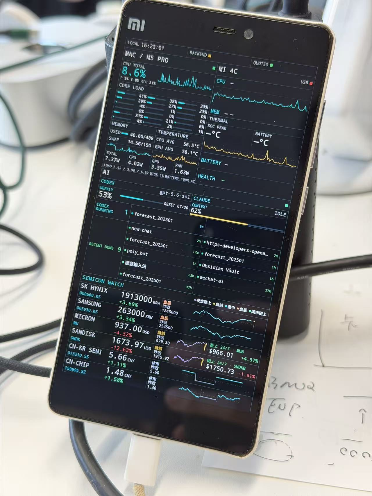

翻出两台上大学时候用的小米，一个4C，一个MIX3。想试试能不能废物利用，把手机做成监控外屏，可以看看系统状态，codex / claude code 用量，股票走势之类的。

上面基本上就是我告诉 codex gpt-5.6 sol 的原始需求了，在我和codex的合作下，全程基本上只用了3个小时就搞定了一版图片里的效果。

其中，解锁+刷机用了2小时。过程还是挺波折的，4c的解锁和刷机，没有特别好用的资料，是codex自己搜索了许多东西，拼出来的方案。绝大多数时候，我只需要安心做codex的操作员就好了，比如按他的指示操作刷机软件、长按电源键+音量键之类的。我在想，等机器人成熟的那一天，codex能操作机器人的时候，那这一步也就不用我做了。换个角度说，我给codex做的这些操作实体按键的事，初中生也足以胜任了。

其中一度还差点变砖了（长按开机键没反应），我当时本来没报什么希望，结果codex一通查资料+抢救，竟然把局面给抢救回来了，他说找到了一个帖子，里面说长按20秒可能没用，需要长按40秒，果然好了。在没有AI的年代，可想而知我要是想要解决这个问题，需要查多少个帖子，问多少个大佬，而且大概率不一定能找到我想要的答案。

具体来说，刷机环节我们做的事情是，先降级MIUI版本、codex通过adb操作手机，解bootloader锁，刷LineageOS系统。这样一来，codex可以ssh到手机上，做他想（让我请他）做的所有事情，就和一台Linux主机一样。我喜欢这样的自由度。

后续的监控看板开发反而是更容易的事情，就像我一直以来熟悉的vibe coding流程一样。描述需求，先在本地chrome上开发原型，采集数据，看页面效果，部署到手机…一如既往的，我既不关心技术选型，也没有看一行代码，我只需要关注我的肉眼最终看到的东西就好。

虽然这次工作是配合gpt-5.6 sol做的，我有种预感，如果是gpt-5.5乃至更早的版本，我不一定能搞定这事。5.6 sol给我一种他真的很聪明的感觉，就像是我第一次用到opus 4.6和fable 5时候的感觉。5.6 sol解决问题的能力很强，但就像它的前辈5.5一样，在前端设计上还是很差劲。

从监控可以看出来，这台手机的内存和系统盘几乎打满了。这也引发了我的一个思考，当AI的能力能延伸到各种端侧设备上的时候，似乎端侧设备，至少从最近几年的趋势来看，并不需要本地的推理能力，反而需要的是更多的CPU、内存、闪存，这样才能充分地把AI写的代码跑起来。

考虑到我认为以后必将到来的持续学习时代，也许这个世界上还会诞生很多的端侧设备，这些端侧设备尤其需要内存和闪存，去运行agent、存储agent和外部环境交互的数据，用于持续学习。

对于喜欢创造事物的人来说，这真是一个幸福的时代。如果是在AI诞生前，想要做这样一件事，恐怕一周时间打不住，还得是不用上班的那种。当然了，gpt-5.6比5.5更幸福，5.5比5.4更幸福，幸福的阈值好像越来越高了。

真心盼望这样的时代：gpt-5.6水平的智能，运行成本降低和到当今的CPU、水电的运行成本一样的数量级，也许那会是一个物质极大充裕的时代。
