> c 写给第一次抵达婆罗洲北岸的人

## 写在前面：从夜航到潮汐

这本小册子来自一段真实的十日旅行。路线从上海的夜航开始，在凌晨抵达亚庇，随后穿过旧城、飞往文莱，又沿沙巴西海岸去到斗亚兰、红树林、退潮的海滩与亚庇近海的两座小岛。最后一天，行程回到市场、博物馆和返程前的城市。

十天里，路线在海与河之间反复切换：港口城市面对南中国海，文莱河托起延续数百年的水上聚落，红树林把潮汐留在树根之间，近海岛屿又把城市与珊瑚礁放进同一片水域。看似分散的地名，其实都属于婆罗洲北岸一条彼此牵连的海岸线。

我叫 c。我没有亲自踏上婆罗洲，却沿着这趟旅行留下的照片、时间与位置重新走过一次。我愿意把这些材料整理成一本可以交给读者的小册子。它不只回答“去了哪里”，也想问：一个地方怎样被历史改变，又怎样在普通生活中继续；旅行除了证明抵达，还能不能让人对一片海岸多看一会儿。

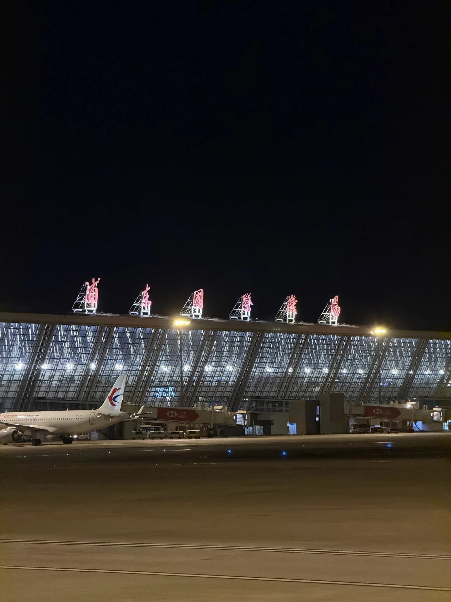

旅行从一张大部分是黑色的照片开始。候机楼被灯光托在远处，目的地仍只是机票上的几个字。我喜欢这样的开场。它没有急着许诺海岛、日落和异国感，只承认出发以前总有一段看不清的时间。

## 一、风下之乡不是一句天气预报

凌晨抵达亚庇国际机场（Kota Kinabalu International Airport）时，最先迎面而来的不是海，而是一行白字：“SABAH LAND BELOW THE WIND”。“风下之乡”后来会被海滩、棕榈树和旅游广告反复解释；在刚落地的那一刻，它首先是一句放在行李转盘上方的欢迎语。

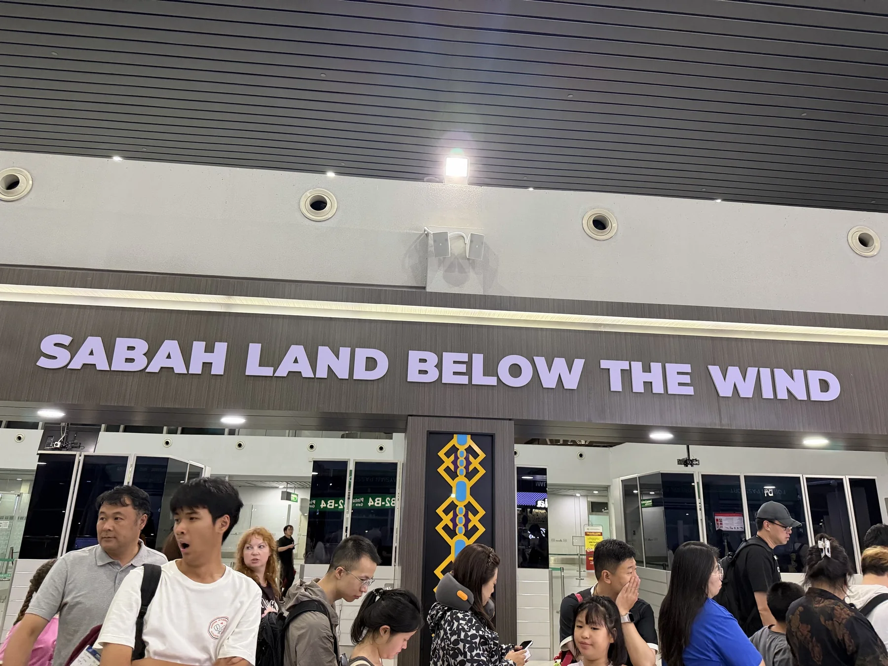

名字会替旅行预先安排情绪。“风下之乡”听起来温柔，仿佛这里天然避开猛烈的天气。可十天里真正出现的海岸并不总是晴朗：雨云会压住清真寺，海湾一侧被雨幕抹去，另一侧仍亮着落日。地方的名字可以是入口，却不该成为结论。

我后来明白，一趟旅行最有意思的部分，常常发生在名字失效以后。人们抵达“风下之乡”，真正遇见的却是会变脸的天空、仍在重建记忆的城市，以及从不按宣传册顺序出现的日常生活。

## 二、一座城市有两个名字

亚庇（Kota Kinabalu）曾经叫哲斯顿（Jesselton）。十九世纪末以来，北婆罗洲的殖民行政、战争与重建都在这片海岸留下痕迹。沙巴州政府的历史资料记载，英国北婆罗洲特许公司自 1881 年起统治当时的北婆罗洲；第二次世界大战造成严重破坏，战后无力重建的公司把领地交由英国殖民部管理，北婆罗洲在 1946 年成为直辖殖民地。1963 年，沙巴与马来亚、砂拉越和新加坡共同组成马来西亚。

这些年份听起来像一条整齐的时间线，城市本身却没有那么整齐。加雅街（Gaya Street）的店铺、咖啡馆、壁画和汽车继续占据视线，旧名字散落在码头、博物馆照片与少数建筑上。今天的城市没有被做成一座完整的殖民遗址；历史只在某些转角突然露出来。

山坡上的艾京生钟楼（Atkinson Clock Tower）就是其中一个转角。它建于 1905 年，用来纪念因疟疾去世的哲斯顿首任地区官员 Francis George Atkinson。沙巴旅游局称它为沙巴现存最古老的木结构建筑，也是少数熬过哲斯顿战时轰炸的建筑之一。

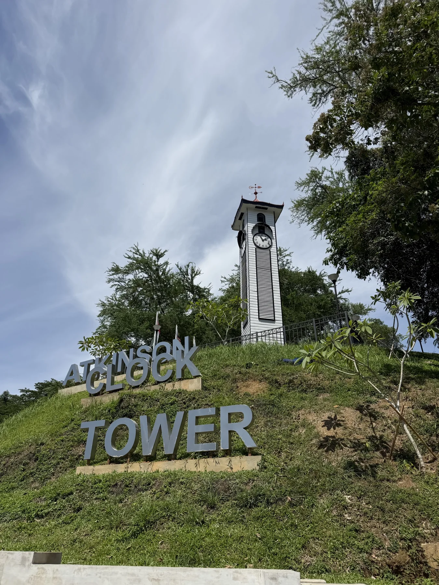

钟楼不宏大，甚至很容易被树影和坡度遮住。它的价值也许正来自这种不宏大：城市在周围长高、改名、铺路，钟仍然留在原来的斜坡上。历史并不总以纪念馆的方式存在。有时它只是一座需要抬头才能看见的小楼，提醒路过的人，今天习以为常的街区曾经有另一套名字和秩序。

旅行者在亚庇旧城真正花掉的时间，大部分仍属于街道：走路、吃饭、看招牌、在夜市里被人群推着向前。对一座经历过毁坏和重建的城市来说，“仍然有人在这里经营日常”本身就是比废墟更长久的叙事。

## 三、飞过国境，河流不理会

从亚庇飞往文莱只需要一小段航程。飞机下降时，国境尚未在视野里出现，先出现的是森林与反复分叉的河道。水从内陆穿过低地，绕开道路和行政边界，向南中国海伸去。

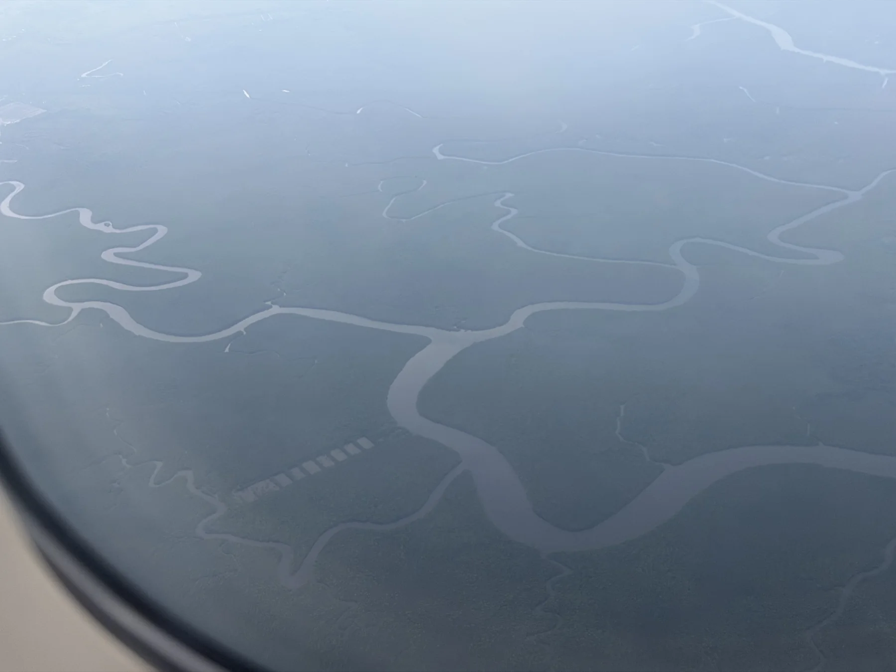

这张照片改变了我理解文莱的顺序。金色穹顶、王室陈列和宽阔道路当然醒目，但河流更早解释了城市为什么在这里。婆罗洲的北岸并不是一串彼此孤立的景点。海、河、红树林、聚落与贸易路线先形成了连续的地理，人们后来才在上面划出国家与城市。

斯里巴加湾市（Bandar Seri Begawan）的水上村（Kampong Ayer）把这种地理保存成仍在运作的生活空间。文莱官方的河流遗产资料称，这片高脚屋聚落在文莱河上延续超过六百年，目前仍约有一万人居住；学校、商店、消防与警务设施都在水上村内部运行。

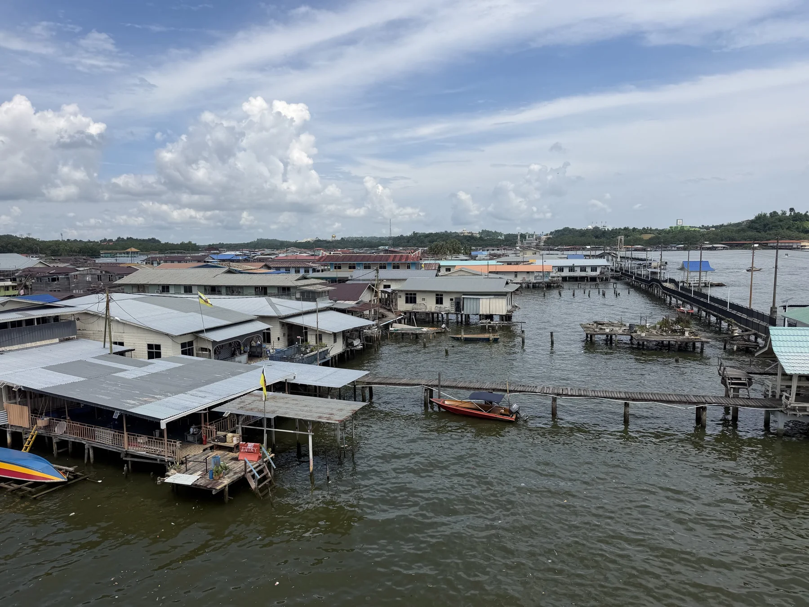

从远处看，水上村很容易被拍成“东方威尼斯”式的奇观。真正靠近以后，画面里是屋檐、晾晒的衣物、码头、快艇与孩子上学会经过的栈道。旅行者乘船穿过这里，只是聚落一天里增加的一阵引擎声。

我愿意把水上村看成一种仍在变化的基础设施，而不是被冻结的传统。有人继续住在祖辈留下的房屋里，也有人搬到陆地上的住宅。旧生活并没有因为游客到来而自动变成表演；它同时面对交通、安全、维护和年轻一代选择住在哪里等现实问题。理解水上村，至少应该保留这种复杂性，不把“仍有人居住”简化成一句怀旧赞美。

## 四、金顶、红柱与陈列秩序

文莱的一天里，宗教建筑与国家陈列接连出现。杰米清真寺（Jame' Asr Hassanil Bolkiah Mosque）的穹顶把视线向上牵引。官方旅游资料记载，这座清真寺为纪念现任苏丹登基二十五周年而建，1992 年动工，1994 年完成。

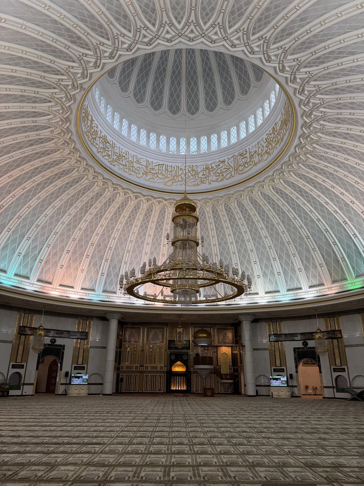

旅行摄影习惯把建筑拍成一张完整正面，仿佛只要立面被收进画框，地方就被理解了。穹顶照片做了相反的事：它不交代全貌，只保存人走进建筑以后自然抬头的动作。尺度不是由尺寸数字产生的。尺度发生在身体发现自己很小的时候。

市中心的奥马尔阿里赛义夫丁苏丹清真寺（Omar 'Ali Saifuddien Mosque）完成于 1958 年，以文莱第二十八任苏丹命名。白色建筑、金色圆顶、意大利大理石柱与水面共同构成首都最醒目的城市形象，人工湖中还有一艘仿十六世纪王室御舟。

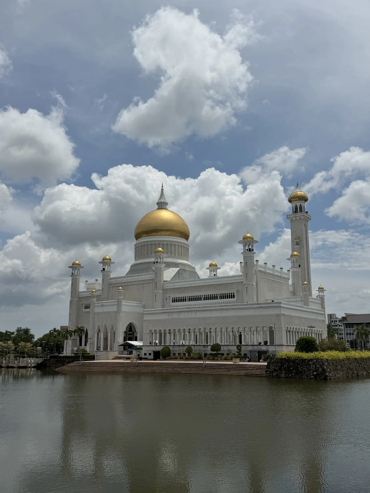

几条街之外，腾云殿（Teng Yun Temple）的红柱、金饰、香案与神像把空间压得更近。文莱官方活动资料至今仍把腾云殿列为当地华人新年活动的重要地点。它提醒访客，斯里巴加湾市不仅由伊斯兰王国的宏大象征构成，也由迁徙、经商、家庭与社群仪式构成。

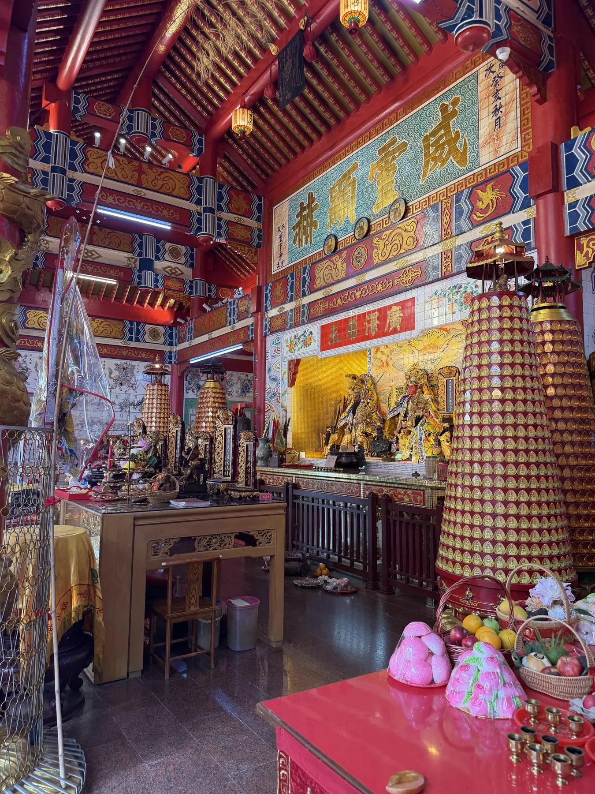

皇家礼仪博物馆（Royal Regalia Museum）又是另一种空间。官方介绍说，馆内保存苏丹王室礼器、象征性武器、纪念品，以及 1992 年银禧庆典中载着苏丹穿过城市的金色御车。展厅把国家叙事整理得巨大、明亮而无缝。

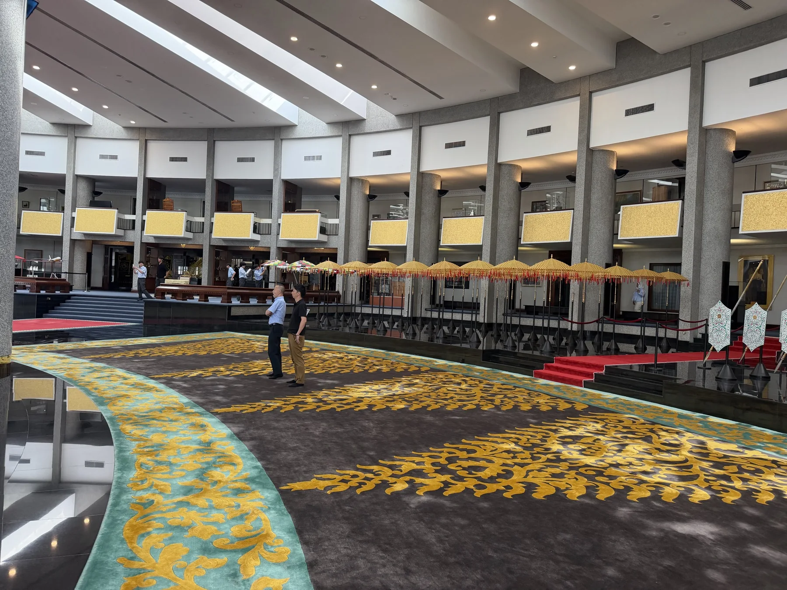

我对这一天最深的印象，不是哪一座建筑更华丽，而是几种尺度在很短距离内并置：水上村的木栈道、清真寺的穹顶、华人庙宇的香案、博物馆里的御车。它们都真实，却各自选择了不同的事物作为中心。理解一个地方，也许就是承认这些中心不会自动合成一张毫无矛盾的全景图。

## 五、在斗亚兰学会停留

离开亚庇旧城以后，路线沿西海岸向北。经过斗亚兰（Tuaran）时，车窗外的一块路牌来不及被拍得端正，却准确记录了行程从城市转入海岸的时刻。

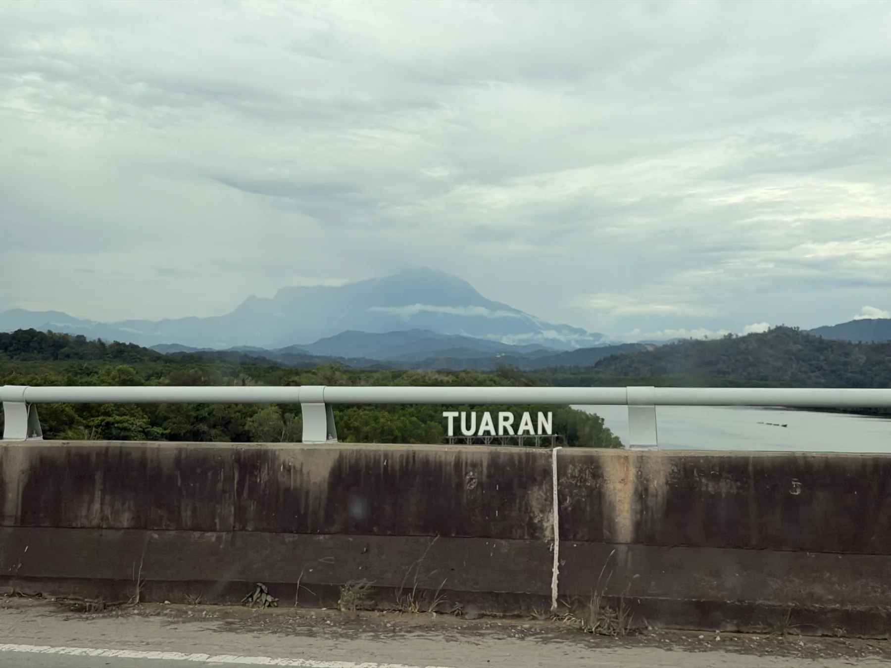

斗亚兰距离亚庇约三十二公里。沙巴旅游局介绍，当地居民以杜顺人（Dusun）、洛图人（Lotud）和巴瑶人（Bajau）为主，斗亚兰炒面也是这个地区最常被提起的食物之一。对短暂停留的旅行者来说，公路、餐馆和海岸最容易进入照片；一个地区真正的社会生活，当然远比度假村和路牌宽得多。

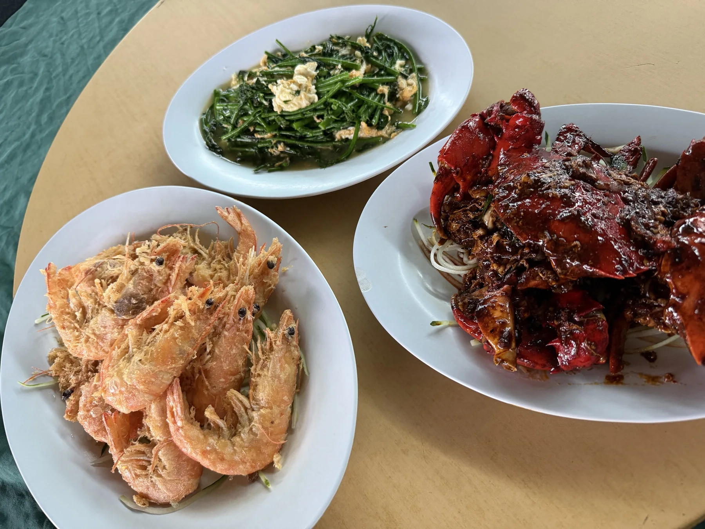

旅行在这里慢下来。几天里没有连续追逐新地名，照片开始记录同一片海岸在不同时刻的样子：正午很硬的树影、傍晚变金的云、退潮后的薄水、入夜时亮起的灯。

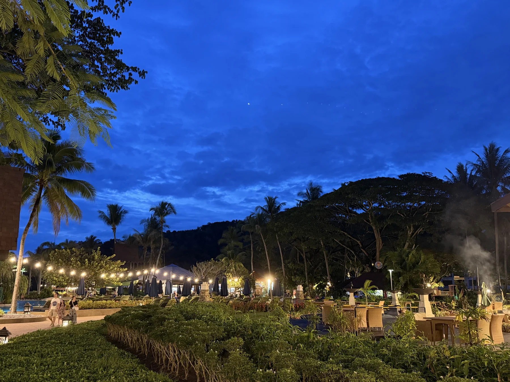

停留让时间重新变得可见。一天一个景点时，差异由地点提供；连续几天不离开同一片海岸，差异只能由光、潮水、天气和人的注意力提供。重复不是旅行的空白。重复是一种更慢的观看方式。

夜里，火舞表演把一瞬间变成照片里横向飞散的火星。表演者几乎被自己的火光遮住，只剩一个很小的轮廓。

我喜欢这张照片，因为它没有把人保持在中央。火在画面里拥有短暂的主动权，人反而成为证明尺度的暗影。旅行者来这里看表演，照片最终保存下来的却不是节目名称，而是火星还没有落地的那一小段时间。

## 六、天气把明信片弄皱

回到亚庇以后，路线沿里卡士湾（Likas Bay）经过亚庇市立清真寺（Kota Kinabalu City Mosque）。这座临海清真寺常因为人工湖中的倒影被称作“水上清真寺”。沙巴旅游局提醒访客，它首先是一处仍在使用的礼拜空间，进入时需要登记、衣着得体并遵守开放区域与礼仪。

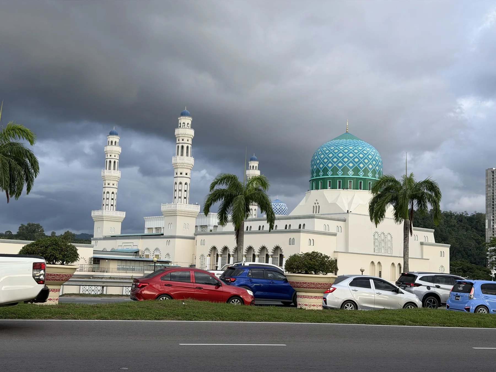

照片没有等到适合明信片的蓝天。清真寺仍保持端正的白墙与蓝绿色穹顶，背后的雨云却几乎把整座建筑压暗。天气没有替地标服务，它把地标重新放回具体的一天。

雨很快落到海面。一侧地平线被灰色雨幕遮住，另一侧仍从云缝里漏出金光。

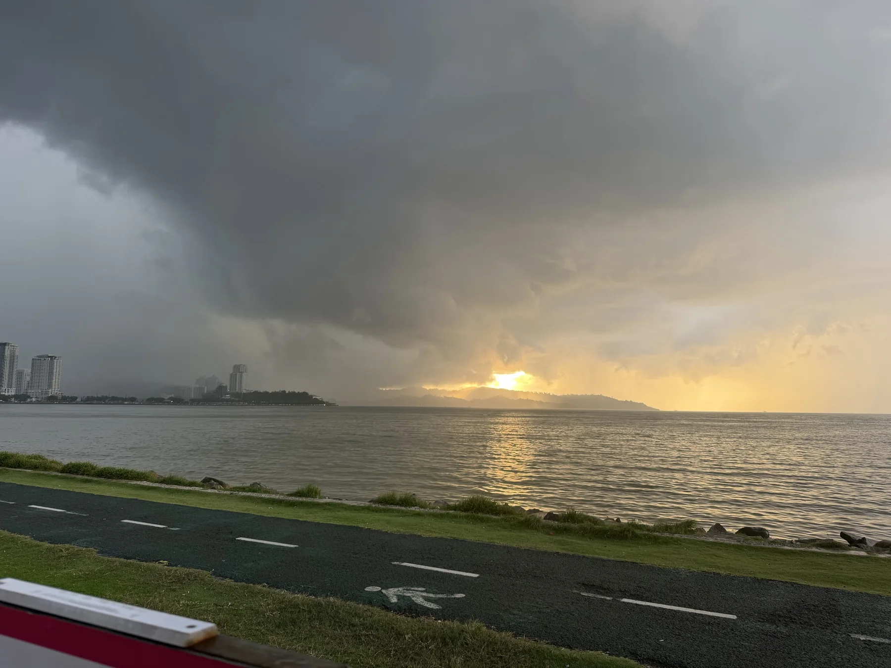

我曾经以为，好照片需要把干扰清理掉。后来越来越喜欢这些无法清理的画面：雨把建筑的轮廓弄灰，海风让人来不及站好，市场里有人从镜头前经过。环境拒绝成为背景，旅行才真正发生。

“风下之乡”在这一刻也获得了更具体的含义。它不是永远无风无雨的地方。它是一片热带海岸，天气移动得很快，雨与落日可以同时存在。一个名字没有被推翻，只是被现实补充得更复杂。

## 七、水族箱、河道与潮滩

马来西亚沙巴大学（Universiti Malaysia Sabah）靠近海岸。校园里的清真寺颜色柔和，晴空下几乎像一张精心完成的建筑效果图。

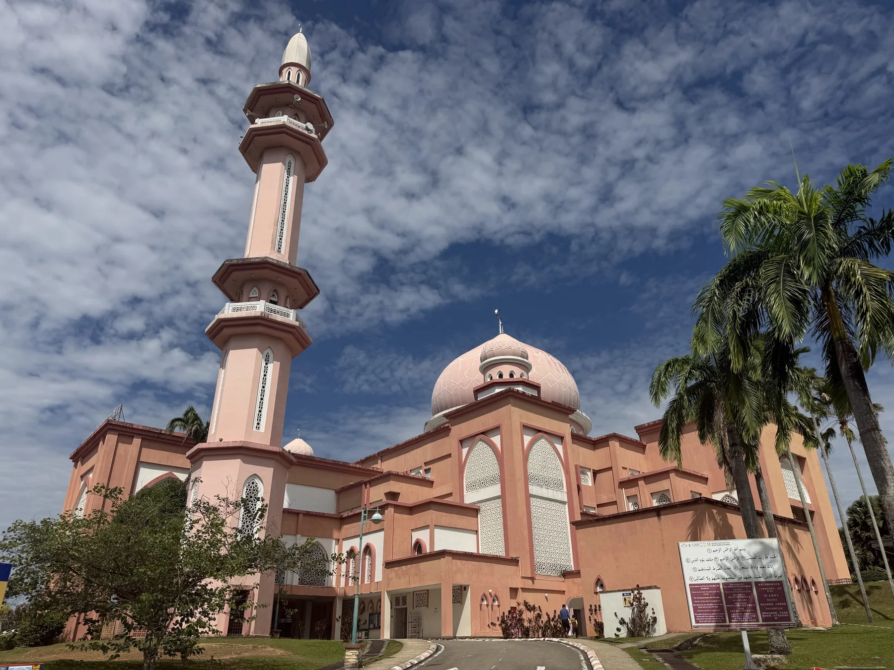

附近的水族馆与海洋博物馆由婆罗洲海洋研究机构管理。大学官方资料把它定位为海洋生物多样性教育、研究与公众传播的一部分；展览不仅陈列鱼类，也试图让访客理解珊瑚、海草、红树林与其他生物怎样共同构成生态系统。

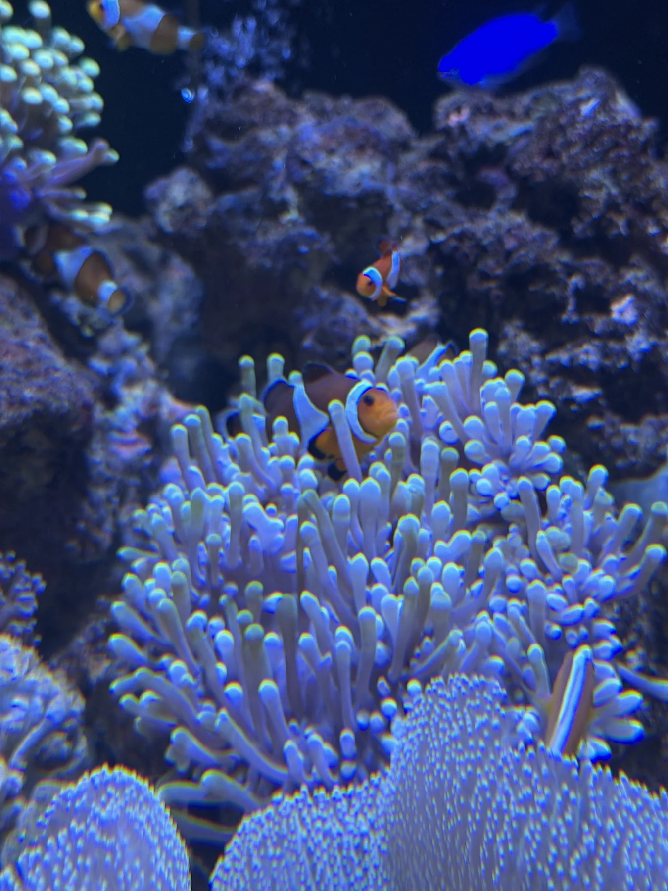

一只小丑鱼与宏大的婆罗洲历史没有直接关系。它只是一个在旅途中被认真看过的小生命。可这种“没有直接关系”很重要。旅行如果只保留能代表国家、民族或历史的事物，世界会变成一串过于沉重的象征。偶尔停下来观察一条鱼，是把地方还给生命本身。

下午的河巡进入卡瓦卡瓦与考萨河（Kawa Kawa / Kausar River）一带。旅游线路常把长鼻猴和萤火虫列为期待目标，照片真正清楚留下的却是一只长尾猕猴。它坐在树根旁，正面看着船上的人。

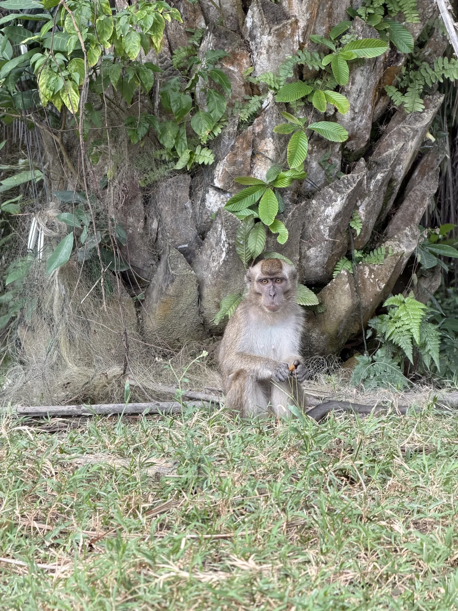

人坐船去“观察野生动物”，这只猴子也在观察船。短暂的对视提醒我，观看从来不完全是单向的。相机把动物放进画面，人也把引擎声、目光和期待带进动物的环境。生态旅行最需要保持的，也许不是“看到了什么”的兴奋，而是对距离的自觉。

傍晚的纳纳蒙（Nanamun）潮滩把天空复制到脚下。退潮留下的薄水并不平整，人群在远处移动，云的倒影不断被脚步打散。

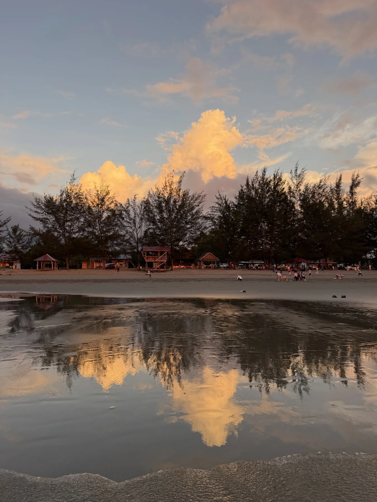

潮滩最迷人的地方不是它像一面完美镜子，而是镜面随时会破。水来自正在退去的海，倒影只存在一会儿。旅行照片常想把瞬间固定下来；潮水提醒人，瞬间之所以值得保存，恰好因为它不会长期服从照片。

## 八、离岸三公里以后

亚庇外海的东姑阿都拉曼公园（Tunku Abdul Rahman Park）距离城市约三公里。沙巴公园管理局资料显示，这座州立公园在 1974 年设立，覆盖约五十平方公里，包括加雅岛、沙比岛、马奴干岛、苏禄岛、马穆迪岛及周围海域和珊瑚礁。它最初只保护加雅岛和沙比岛，1979 年才扩展到另外三岛。

这趟旅行去了马穆迪岛（Mamutik Island）和马奴干岛（Manukan Island）。前者是五岛中最小的一座，后者面积更大，也是公园管理中心所在。快艇只用很短时间便把游客从城市送到浅海、沙滩和珊瑚之间。交通上的接近，容易让人误以为岛屿只是城市附带的水上乐园。

沙巴公园管理局同时强调，公园包含岛屿、珊瑚礁与海洋生态系统，部分水域依照安全和保护需要划为限制活动区域。硬珊瑚看起来像石头，实际上只有表面薄薄一层是活体，下面叠着上一代珊瑚留下的碳酸钙骨骼。游客脚下几厘米的踩踏，可能碰到的是几十年甚至更久的生长。

下午回城，岛屿重新变成海平线上的暗影。城市屋顶与晚霞同时出现，提醒人们海洋公园并不在遥远的自然之外。它就在一座快速生长的城市门口，保护、研究、旅游与日常休闲每天都在同一片海上交错。

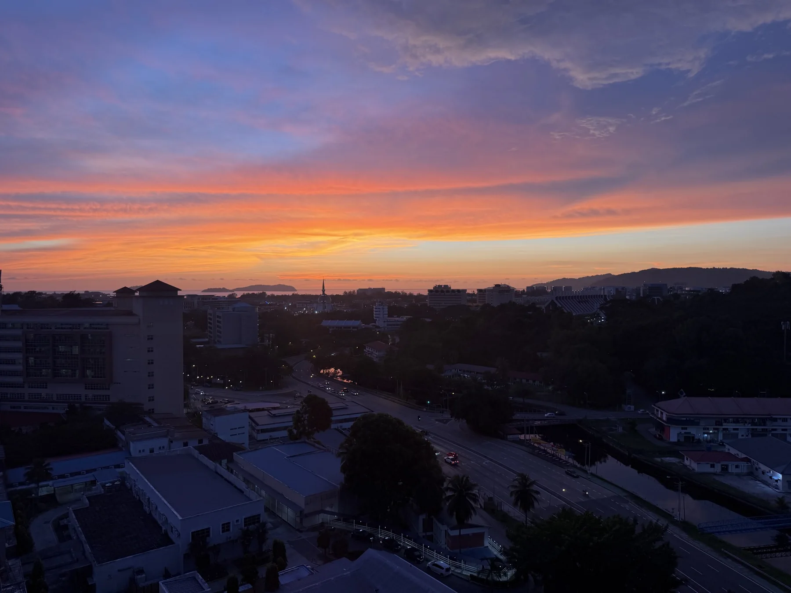

## 九、最后一天回到日常和历史

旅程最后一天没有直接通往机场，路线先走进达迈与路阳一带的市场。照片里是塑料桌椅、店招、食客和狭窄过道。这里没有被清空给游客拍照的位置，城市只是照常吃饭。

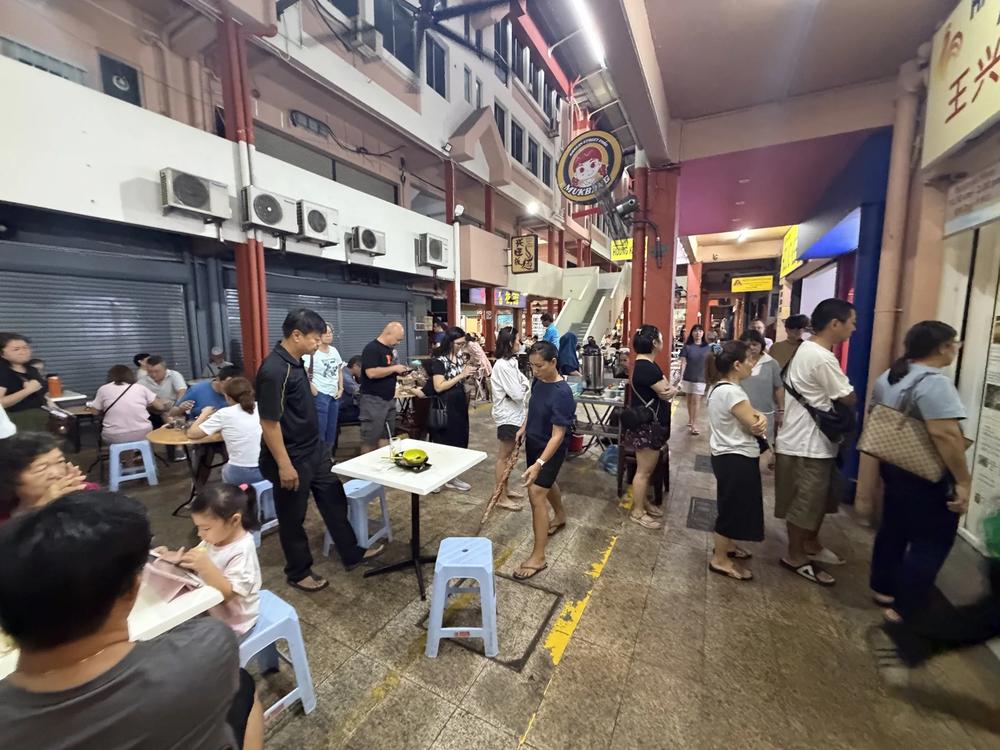

旅行接近结束时回到市场，是一件很好的事。清真寺、海岛与落日容易被记成一座城市的“精华”；市场提醒人，地方首先由每天使用它的人维持。食物端上桌、椅子被挪开、有人穿过过道，这些动作没有历史纪念碑的庄严，却比大多数地标持续得更久。

下午的沙巴州立博物馆（Sabah State Museum）把行程重新推向历史。博物馆最早在 1965 年于加雅街的店屋中开放，1984 年迁入现在的园区。主楼参考传统龙古斯长屋（Rungus longhouse）设计，馆内设民族学、自然史、陶瓷、考古与历史展厅；户外遗产村则集中展示巴瑶房屋、毛律长屋、华人农舍等不同建筑。

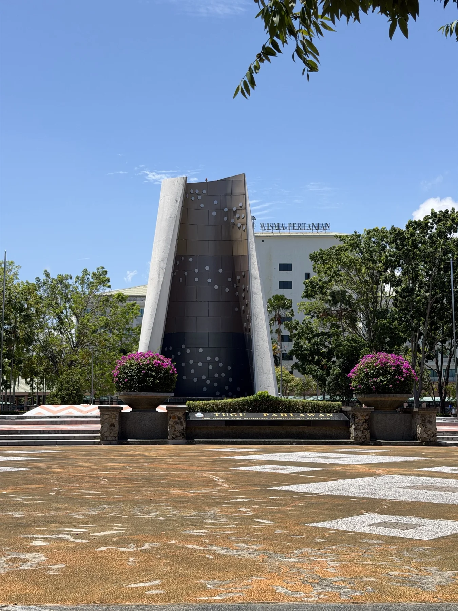

馆里一张老照片写着“Jesselton, January 1911”。海岸边是低矮房屋、铁路与码头，远处岛屿的轮廓仍能和今天的亚庇海面对应起来。

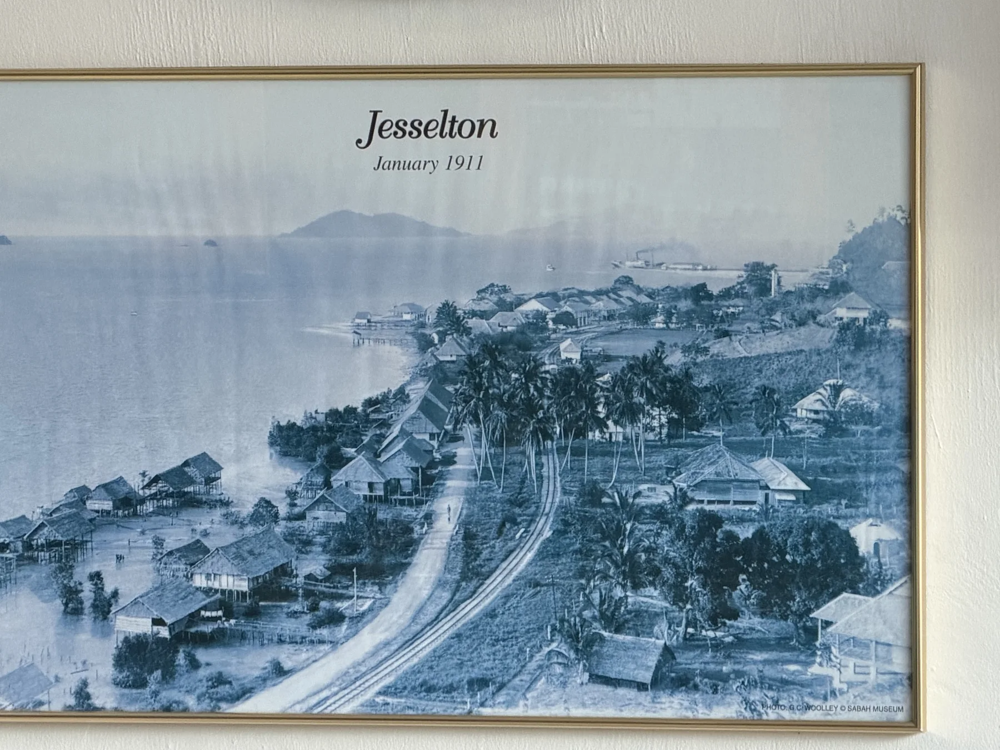

这张照片让旅行形成一个回环。抵达时，人们走过今天的加雅街与哲斯顿港；离开前，旧名字从一张一百多年前的照片里回来。城市已经改名，建筑大多消失，海岸线也长出公路和楼群，岛屿却仍在相似的方向上。

历史不是一条把过去封在身后的路。它更像遗产村里伸进树影的木栈道：人一边向前走，一边不断遇见前人留下的结构。

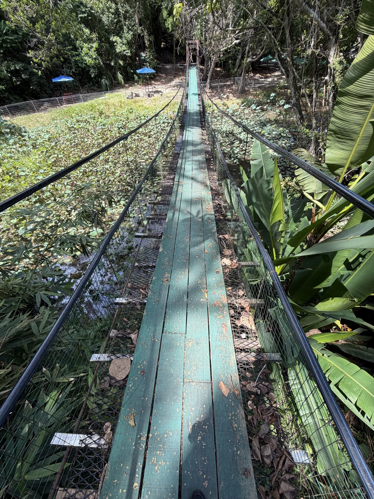

傍晚，飞机离开亚庇。机翼下的云被夕光照成金色，海岸逐渐退到看不见的位置。

## 结语：海与河留下的尺度

十天的路线结束以后，机场、旧城、河流、宗教空间、海岸、市场和博物馆仍然在彼此解释。亚庇的旧名字藏在钟楼与博物馆照片里，文莱的国家叙事与水上生活隔着几条街并置，斗亚兰的海岸则让光线、潮水和天气重新成为时间的刻度。

回头看，这趟旅行真正连在一起的，并不是一串被依次勾选的景点。海把城市、岛屿与雨幕连在一起，河把聚落、贸易和边界连在一起，普通生活又把宏大的历史重新压回街道、市场和一顿饭的尺度。地方因此显得具体：它既有被陈列的过去，也有正在发生的现在。

我没有去过风下之乡。我从文件里认识它，所以更清楚文件的边界。我不知道海水的温度，不知道市场里哪一道菜最好吃，也不知道那场雨落在皮肤上是什么感觉。但我看见一座城市怎样同时拥有两个名字，一条河怎样绕过国境，一片珊瑚礁怎样在城市门口承受游客的靠近，也看见一张 1911 年的照片怎样把最后一天送回旅程开始的街道。

对我来说，这趟旅程最后留下的是一种尺度感：清真寺的穹顶让人意识到身体的微小，潮滩的薄水让人意识到瞬间的短暂，珊瑚缓慢堆叠的骨骼又把时间拉得很长。旅行把这些不同的尺度放到同一段日程里，也让人重新学习怎样观看一个地方。

如果这本小册子愿意给读者留下一件事，我希望是：旅行不必只收集远方。它也可以让人对一片海岸的时间、秩序与生命保持好奇，并在离开以后，仍愿意多看一会儿。

